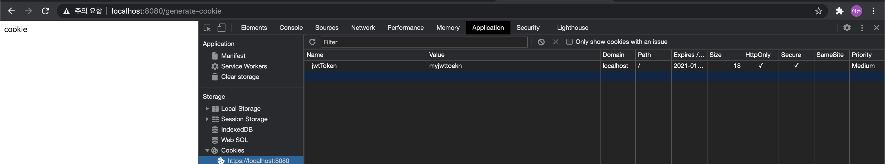

# Springboot에서 쿠키 생성 및 삭제 

### 쿠키 생성 

```java
  @GetMapping(value ="/generate-cookie")
    public ResponseEntity<?> generateCookie(HttpServletResponse response){

        String jwtToken = "myjwttoekn";
        Cookie myCookie = new Cookie("jwtToken", jwtToken);
        myCookie.setMaxAge(3600); // 매개변수는 초 기준
        myCookie.setPath("/"); // 모든 경로에서 접근 가능 하도록 설정
        myCookie.setHttpOnly(true);
        myCookie.setSecure(true); 
        response.addCookie(myCookie);
        
        return new ResponseEntity<String>("cookie", HttpStatus.OK);
    }

```


- 사진을 확인해보면 쿠키가 정상적으로 등록 되었음을 확인 가능함 ! 
- 보안상의 이유로 필히 `httpOnly`,`secure`는 꼭 셋팅해줘야함 

- Secure 쿠키 
  - HTTPS 프로토콜 상에서 암호화된(encrypted) 요청일 경우에만 전송됨
  - 실제 스프링부트를 ssl 통신하지 않는 http 프로토콜을 사용하는 경우 쿠키가 저장 안되는걸 확인 할 수 있음 ! 

- HttpOnly 쿠키 
  -  XSS(Cross-site 스크립팅) 공격 방지를 위한 쿠키.
  -  HttpOnly 쿠키는 JavaScript의 document.cookie API에 접근할 수 없음. 서버에게 전송되기만 함
  -  예를 들어 서버에서 지속되고 있는 쿠키는 JavaScript를 사용할 필요성이 없기 때문에 HttpOnly 플래그가 설정될 것


### 쿠키 삭제

```java

    @GetMapping(value="remove-cookie")
    public ResponseEntity<?> removeCookie(HttpServletResponse response) {
      
        Cookie myCookie = new Cookie("jwtToken", null);
        myCookie.setMaxAge(0); // 쿠키의 expiration 타임을 0으로 하여 없앤다.
        myCookie.setPath("/"); // 모든 경로에서 삭제 됬음을 알린다.
        response.addCookie(myCookie);
        return new ResponseEntity<String>("cookie", HttpStatus.OK);
      
    }
```

### 쿠키 정보 가져오기 
```java
@GetMapping(value="read-cookie")
public ResponseEntity<?> readCookie(HttpServletRequest request) {
    Cookie[] myCookies = request.getCookies(); // request에 담긴 쿠키 조회 

    for(Cookie cookie: myCookies) {
       if(cookie.getName().equals("jwtToken")){
          String token = cookie.getValue();
          log.info("token : {}",token); // 콘솔창에 jwtToken 이라는 이름으로 저장한 쿠키의 값이 출력 됨 
       }
   }
}
```


### 정리를 마치며

- 회사 데모 페이지를 구현하면서 세션대신 jwt 토큰을 사용하였다. 근데 나는 jwt 토큰을 header와 localStorage에 저장 후 서버에게 요청을 보낼때 마다 localStorage에서 jwt 토큰 값을 가져와 header에 담는 과정을 반복하였다.
이렇게 되면 보안상의 이유로 좋지 않다는 사수의 조언을 들어 수정하게 되었다. 그리고 정리하면서 느낀점은 나는 현재 jwt 토큰을 제대로 사용하지 못하고 있음을 인지하였고 jwt 구현법을 좀 더 고민 후 til에 업로드 및 프로젝트에 적용해야겠다 흑흑구ㅜㅜㅜㅜㅜ
